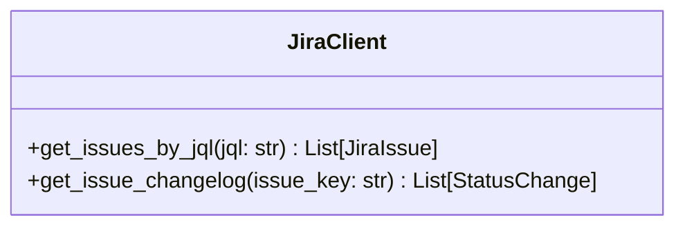
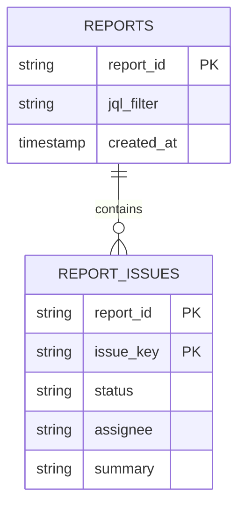

# Status Report Feature Implementation Plan

## Overview
Add ability to generate Jira status reports from JQL filters with:
- SQLite-based historical tracking
- Multiple output formats (text/markdown/html)
- Change detection between runs

## Components

### 1. Jira Client Enhancements


### 2. Report Storage (SQLite)


### 3. Report Generator
```python
class FormattingOptions(BaseModel):
    output_format: Literal["text", "markdown", "html"] = "text"
    include_changelog: bool = False
    max_issues: int = 50

class ReportGenerator:
    def generate(self, 
               current_issues: List[JiraIssue],
               previous_report: Optional[Report],
               options: FormattingOptions) -> str:
```

### 4. CLI Integration
```python
@cli.command()
@click.option("--jql", required=True, help="JQL filter for issues")
@click.option("--format", type=click.Choice(["text", "md", "html"]), default="text")
@click.option("--output", type=click.Path(dir_okay=False), help="Output file path")
def generate_report(jql, format, output):
    """Generate status report from Jira issues"""
```

## Implementation Phases

1. **Phase 1**: Core JQL query and text report generation
   - JiraClient JQL support
   - Basic report generator
   - CLI integration

2. **Phase 2**: Historical tracking
   - SQLite storage
   - Change detection
   - Markdown/HTML output

3. **Phase 3**: Advanced features
   - Custom templates
   - Email integration
   - Scheduled reports
